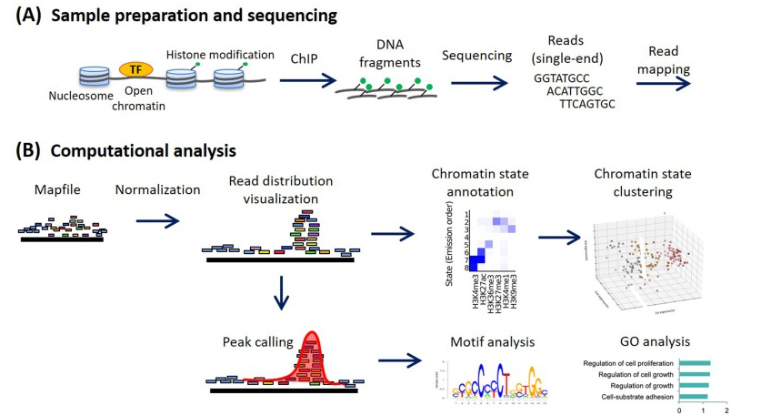
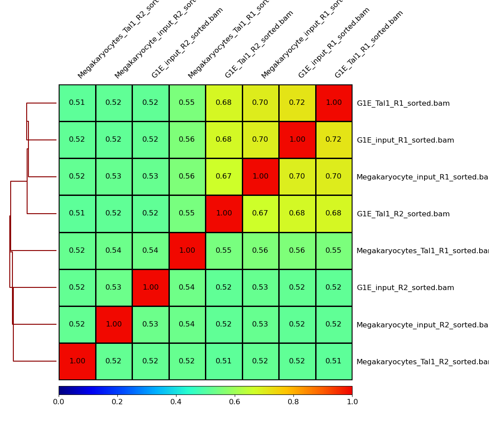
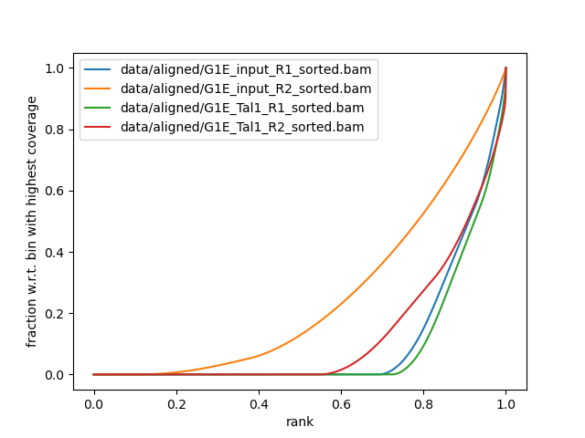
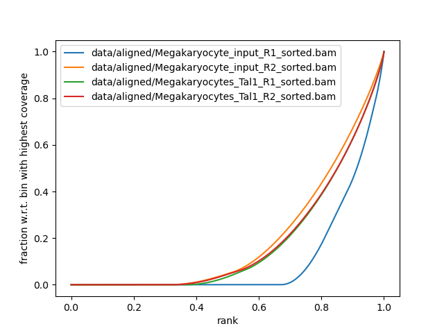

# *ChIp-Seq pipeline for Identification of the binding sites of the T-cell acute lymphocytic leukemia protein 1 (TAL1)*

### Compiled by *Desmond Akabetso Nde*
### Last updated on the *13 of January 2025*
### *Enjoy reading through and do not hesitate to comment your thoughts on my approach and analysis.*

The aim of this study is to:
- Reproduce the ChIP-Seq pipeline from [Galaxy](https://training.galaxyproject.org/training-material/topics/epigenetics/tutorials/tal1-binding-site-identification/tutorial.html)
- Investigate the dynamics of occupancy and the role in gene regulation of the transcription factor TAL1, a critical regulator of hematopoiesis, at multiple stages of hematopoietic differentiation. 

## Introduction
let's start by defining a clearer picture of what is a Chromatin Immunoprecipitation Sequencing (ChIP-Seq).

According [Ryuichiro Nakato et al.](https://www.sciencedirect.com/science/article/pii/S1046202320300591?via%3Dihub), ChIP-Seq is a central method in epigenomic research. It provides genome-wide chromatin analysis of histone modification describing how epigenomic signatures contribute to define cell identity and development, lineage specification and disease. Chromatin is generally tightly packed within the nucleus, but its structure can be altered through modifications such as methylation or acetylation. These modifications can lead to chromatin relaxation, which exposes the DNA and allows regulatory proteins, such as transcription factors and enhancers, to bind to the accessible regions of the genome and initiate transcription or other molecular processes.

Figure 1: A)Sample preparation, B) Canonical computational anylis workflow.

## Workflow from Galaxy
1. Quality control
2. Trimmin and clipping reads
3. Aligning reads to a reference genome
4. Assessing correlation between samples
5. Assessing IP strength
6. Determining TAL1 binding sites
7. Inspection of peaks and aligned data (IGV)
8. Identifying unique and common TAL1 peaks between stages
9. Generating Input normalized coverage files
10. Plot the signal on the peaks between samples
11. conclusion

### Dataset
This dataset was published from a study by [Wu et al. 2014](https://genome.cshlp.org/content/24/12/1945). This dataset was downsampled and uploaded on [zenodo](https://zenodo.org/records/197100) for rapid processing on a local machine. It consist of a biological replicate TAL1 ChIP-Seq and input control experiments. Input control experiments are used to Identify and remove sampling bias such as open|accessible chromatin or GC bias. 
The ChIP-Seq experiments were performed in multiple mouse cell types including G1E - a GATA-null immortalized cell line derived from targeted disruption of GATA-1 in mouse embryonic stem cells and megakaryocytes. 

### Quality control
First step was to run quality control with fastQC, The end of the reads fell below phred score of 20 (at least 1% base is incorrect) which is normal for ilumina siquencing because of signal decal or phase biase at the end of the reads.

Reads below 20 phred score was trimmed with Trimmomatic in single-reads mode. After trimming, reads length span a range of values. 

### Alignment

The bwa alignment tool was used to map the reads to the reference genome with each read alligned to the different chromosomes of origin. There were a few contigs which could not be assiged within the reference genome (generally, this could represent novelty sequences within the reference genome or simply imperfection of the alignment tool). The output was directly converted from sam to bam and sorted to ease visualization with igv. 

After mapping, we generated the correlation of the maping quallity between the samples. This equally help to assess the similarity between the replicates sequencing datasets and read counts for different datasets. it is aslo helpfull to estimated the expression levels based on chromatin modifications accross samples. *multBamSummary* from deeptools was used here.

Figure 2: Sample correlation (from bam files)

We equally Identify the quality of the Immunoprecipitation within the experiment with *plotFingerprint* from deeptools. It provides a direct comparison of the ChIP signal between the replicates and the input file. Input files are generally not enriched and should posses a linear curve while ChIP are enriched and signal strenght will follow a sharp peak. From this, we can see that the ChIP enrichment of the G1E cell line was not the best because the curve line between the input and TAL1 is not the best for replicate 1 but was perfectly enriched for replicate 2. Megakaryocytes is shown to be better than G1E too from thisi analysis. 
#(results/Megakaryocyte_G1E_signal_strenght.png)
 

Figure 3: Left) G1E, right) Megakaryocytes
